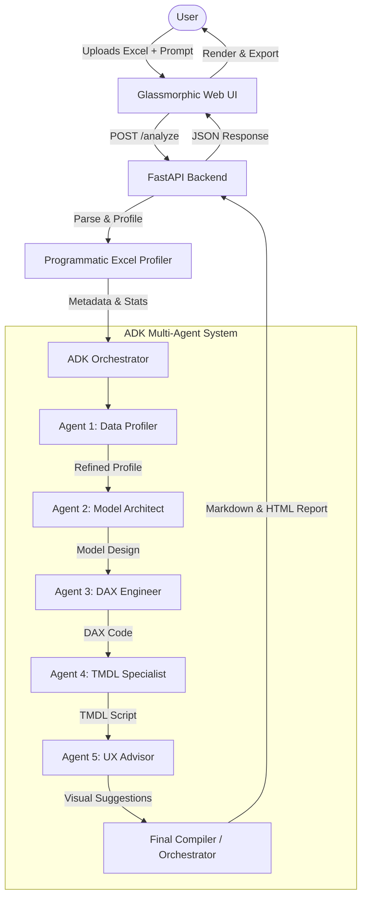

# DESIGN_SPEC.md

## Overview
The **Digital Power BI Employee** is a multi-agent system designed to act as a virtual Power BI developer. It takes an uploaded Excel file (`.xlsx`) and a natural language prompt describing the user's business goals or KPIs, profiles the dataset, designs an optimal model schema, generates DAX measures, drafts TMDL automation scripts, and provides step-by-step instructions for implementation in Power BI.

The system is built on Google's **Agent Development Kit (ADK)**. It is exposed as a cohesive backend service using FastAPI, with a premium, responsive glassmorphic web UI for end-users to upload files, submit prompts, and view/download the generated reports in Markdown and formatted HTML.

---

## Example Use Cases

### 1. Sales Performance Dashboard
*   **Input File**: `sales_data.xlsx` (contains OrderID, OrderDate, CustomerID, ProductID, UnitPrice, Quantity, Discount).
*   **User Intention**: "I want to track total sales, sales growth month-over-month, customer retention rate, and see which product category generates the highest profit margin."
*   **Expected Output**:
    *   Detailed profiling of sales transactions (e.g., date formats, missing customer info).
    *   Star schema design (FactSales, DimCustomers, DimProducts, DimDate).
    *   DAX measures: `Total Sales`, `MoM Sales Growth %`, `Customer Retention %`, `Profit Margin %`.
    *   Detailed page design with slicers for Region and Category, and trend lines for monthly sales.

### 2. HR Employee Attrition & Headcount
*   **Input File**: `hr_roster.xlsx` (contains EmployeeID, HireDate, ExitDate, Department, Salary, PerformanceRating, Age, Gender).
*   **User Intention**: "Analyze employee attrition rate, average tenure, salary distribution by department, and predict future attrition hotspots based on performance vs tenure."
*   **Expected Output**:
    *   Profiling of active vs exit dates (handling null exit dates for active employees).
    *   Snowflake/Star schema mapping HR transactions to Department and Employee details.
    *   DAX measures: `Active Employees`, `Attrition Rate`, `Average Tenure (Months)`.
    *   Instructions on creating a role-playing date relationship in Power BI.

---

## Tools & Utilities Required
1.  **Programmatic Excel Profiler**:
    *   Uses `pandas` and `openpyxl` to extract sheet names, row/column counts, data types, null counts, unique value counts, and descriptive statistics.
    *   Detects high-cardinality ID columns (potential primary keys) and date formats.
    *   Passes this data profile as a structured text block directly to Agent 1.
2.  **ADK multi-agent orchestrator**:
    *   Leverages the ADK SDK to run a sequential chain of 5 specialized agents.
    *   Passes state downstream (Profile -> Model -> DAX -> TMDL -> UX -> Compiler).
3.  **FastAPI Backend**:
    *   Handles file uploads safely, triggers the profiling and ADK pipeline, and handles asynchronous processing.
4.  **Premium Frontend Web UI**:
    *   Responsive glassmorphism design using modern CSS.
    *   Provides file drag-and-drop, real-time loading animation state, and high-fidelity preview of the output Markdown report (using a markdown renderer).

---

## Constraints & Safety Rules
*   **No Placeholders or Generalizations**: Every DAX measure, schema relationship, and instruction step must be concrete and directly reference the column names found in the uploaded file.
*   **No Assumption of Expertise**: Assume the user has zero experience with Power BI. Always specify exactly where to click (e.g., "In the ribbon, select Modeling tab -> New Measure").
*   **Power BI Limitations Handling**: The system must verify rows and columns against Power BI limits (e.g., advising Import mode vs DirectQuery for size, warning against bidirectional filtering where single direction suffices, calculated columns vs. measures performance rules).
*   **Strict Output Format**: The report must contain exactly the six numbered sections matching the user-requested template.

---

## Success Criteria
1.  **Completeness**: Generates all 6 required sections for any valid Excel file and prompt.
2.  **Accuracy**: DAX syntax is mathematically correct and references actual columns.
3.  **Star Schema Projections**: Accurately separates transactional records (Fact tables) from lookup entities (Dimension tables).
4.  **UX Excellence**: Frontend layout is extremely premium, feels responsive, and features clean, polished styling.
